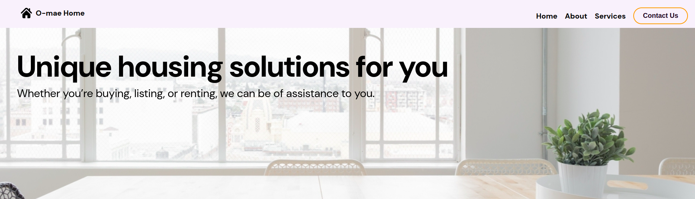
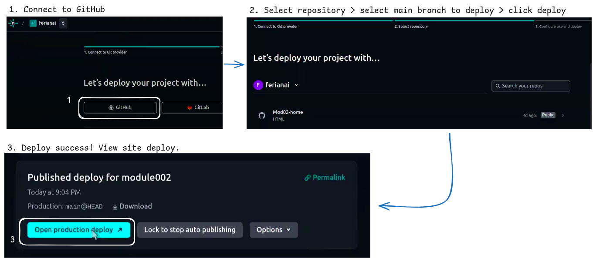
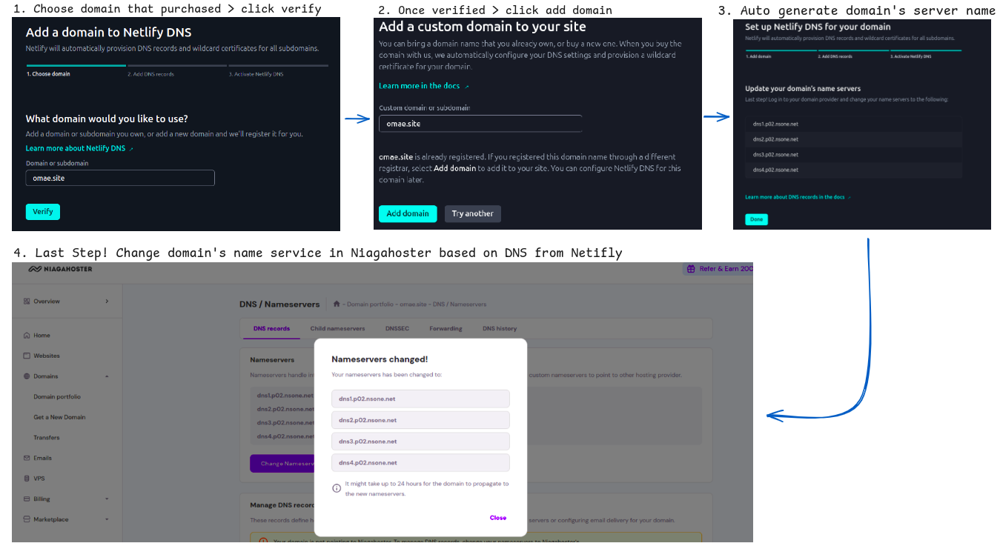

# Company Profile Website - Home & Building Developer
Welcome to our Company Profile website, designed for Home and Building development. This website serves as an introduction to our company, its services, and contact information.

### Website URL: [https://omae.site](https://omae.site)

## Table of Contents

1. [Home](#home)
2. [About](#about)
3. [Services & Products](#services-products)
4. [Contact Us](#contact-us)
5. [Responsive Design Implementation](#responsive-design-implementation)
6. [Deployment Instructions](#deployment-instructions)

---

## Home

The **Home** section introduces the company and gives visitors a brief overview of our values and vision. This section includes:
- A hero image and welcome message.
- Links to the About, Services, and Contact sections.

### Example:

```html
<section class="banner" id="home">
    
    <div class="banner-title container">
        <h1>Unique housing solutions for you</h1>
        <p>Whether you’re buying, listing, or renting, we can be of assistance to you.</p>
    </div>       
</section>
```
---

## About
Founded in **2024**, **O-mae Homes** is a full-service realty company that assists homeowners from the selection of their property, through financing, all the way to the purchase of their dream homes. Our team is committed to providing world-class standards in every aspect of the home-buying experience. 

We offer a wide range of properties that are designed to fit every lifestyle, with affordable rates without compromising on quality. Whether you're looking for your first home or expanding your portfolio, O-mae Homes is here to guide you every step of the way.

### Our Values:
- **Integrity**: We prioritize honesty and transparency with all of our clients.
- **Quality**: Every property we offer meets world-class standards for comfort and durability.
- **Affordability**: We believe that great homes should be accessible, and we offer pricing that fits a wide range of budgets.
- **Customer-Centric**: Our clients' satisfaction is our top priority, and we work to ensure their home-buying experience is smooth and stress-free.

We are proud to be a trusted partner in building your future home.

---

## Services & Products
The **Services & Products** section highlights the different services we offer, including:
- Residential listings
- Renovations and remodeling
- Architecture & design consulting

```html
<section id="services">
    <h2>Services & Products</h2>
    <ul>
        <li>Residential Construction</li>
        <li>Renovation & Remodeling</li>
        <li>Architecture & Design Consulting</li>
    </ul>
</section>
```

---

## Contact Us
The **Contact Us** section provides a form for visitors to get in touch with us. Include our office address, email, and phone number.

```html
<section id="contact">
    <h2>Contact Us</h2>
    <form action="/submit-form" method="POST">
        <label for="name">Your Name</label>
        <input type="text" id="name" name="name" required>
        
        <label for="email">Your Email</label>
        <input type="email" id="email" name="email" required>
        
        <label for="message">Message</label>
        <textarea id="message" name="message" required></textarea>
        
        <button type="submit">Send Message</button>
    </form>
</section>
```
---
## Responsive Design Implementation
This website is fully responsive, ensuring that it looks great on all devices, from desktops to smartphones. The following techniques are used to implement responsiveness:

- **Flexible Layout**: Using CSS Flexbox or Grid to structure sections that adapt to different screen sizes.
- **Media Queries**: Different styles are applied depending on the screen width to adjust layout, font sizes, and other elements for mobile devices.

```css
/* Example media query for small screens */
@media (max-width: 800px) {
    /* Adjust font size of h1 headers */
    h1{
        font-size: 40px; /* Adjusts heading font size for smaller screens */
    }
    /* Adjust layout of .content-service section */
    .content-service{       
        padding-top: 20px;
        flex-direction: column; /* Stack items vertically */
        width: 100%;            /* Ensure the container takes up the full width */
    }
}
```

---

## Deployment Instructions

### **1. Deployment with GitHub**
1. Create a GitHub repository for the project, and make it as public.
2. Push the project files to the repository (HTML, CSS, JS, and any other assets).
3. Make sure the repository contains an `index.html` file as the entry point.

```bash
git clone https://github.com/revou-fsse-oct24/milestone-1-ferianai.git
git add .
git commit -m "add file img, modified html and css file"
git push -u origin main
```

### **2. Deployment with Netlify**
Netlify is an easy and fast way to deploy static websites. Here’s how to deploy the site:
1. Push the repository to GitHub as described above (public repo).
2. Log in to Netlify account at https://www.netlify.com.
3. In the Netifly dashboard, click "Add New site > Import an existing project"  and connect to GitHub repository
4. Choose the public repository and branch to deploy (typically `main`).
5. Click "Deploy site" and Netlify will automatically build and deploy the site.




### **3. Deployment with Niagahoster**
Niagahoster is a web hosting provider that offers easy deployment for websites. Follow these steps:
1. **Log in to Niagahoster account** and go to the **DNS Management** section.
2. **Locate the DNS Settings**, find the section for DNS management or Nameservers. This is where we can modify the domain's DNS records.
3. **Update the Nameservers**: Replace the current nameservers with Netlify’s nameservers. The nameservers you'll need to use are:
  - dns1.p01.nsone.net
  - dns2.p01.nsone.net
  - dns3.p01.nsone.net
  - dns4.p01.nsone.net
4. **Save Changes** : After updating the nameservers, save the changes.
5. Wait for DNS Propagation : It may take anywhere from a few minutes to 48 hours for the DNS changes to propagate globally. Once done, the site will be accessible at **[https://omae.site/](https://omae.site/)**.



---


### Key Points in the README:

1. **Sections**: The homepage has the four sections: Home, About, Services & Products, and Contact Us. Each section includes sample HTML code.
2. **Responsive Design**: The README includes basic instructions and CSS media queries for making the website responsive.
3. **Deployment Instructions**: Detailed steps on how to deploy the website using GitHub, Netlify, and Niagahoster, including the commands and setup for each.

This should help you set up the website for your Home & Building Development company, ensuring a smooth deployment and easy-to-follow instructions for collaborators.

---

### Repository Links:
- **GitHub Repository**: [GitHub Repository URL](https://github.com/ferianai/Mod02-home)
- **Niagahoster Domain**: [omae.site](https://omae.site/)

---

### Contributing
We welcome contributions to improve the website. Feel free to fork the repository, make changes, and submit pull requests.

---
